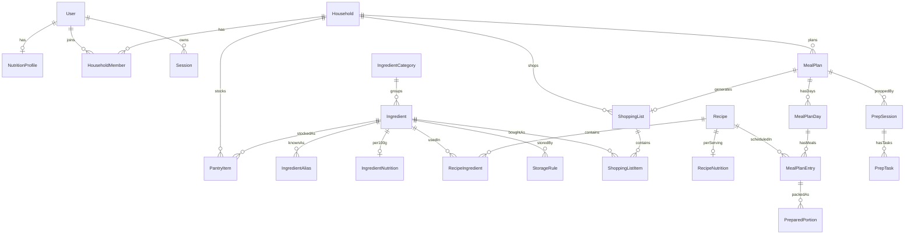

# MULTI-CHEF — Системная архитектура и Техническое Задание для ИИ-разработчика (Minimax M3)

**Версия документа:** 1.0
**Дата:** 2026-09-08
**Статус:** Утверждённый baseline для генерации кода
**Источники:** `Мульти_шеф.txt` (концепция), `Мульти_шеф_-_2.txt` (расширенные сценарии), `Мульти_шеф_-_ТЗ.txt` (технический стек и ограничения)

> Этот документ — единственный источник истины для генерации кода. Любое отклонение фиксируется через ADR в `docs/decisions/`.

---

# БЛОК 1. System Overview & Scope

## 1.1. Суть продукта

**«Мульти Шеф»** — mobile-first PWA, которое строит план питания из **уже имеющихся продуктов**, учитывая бюджет, время, настроение, КБЖУ и сроки хранения, и формирует **умный список покупок**, где каждый купленный продукт используется в нескольких блюдах.

**Позиционирование (официальное):**
> «Мульти Шеф — решает, что приготовить сегодня и что купить, чтобы ничего не пропало завтра».

**Ключевой дифференциатор — «продуктовая цепочка»:** система подбирает блюда так, чтобы:

1. один продукт использовался в нескольких рецептах;
2. упаковки расходовались максимально полно;
3. скоропортящиеся продукты использовались первыми;
4. остатки одного блюда становились основой следующего;
5. пользователь реже выбрасывал еду.

Приложение — **не база рецептов**, а система принятия бытовых решений. Пользователь получает готовый ответ, а не вдохновение.

## 1.2. Роли пользователей

| Роль | Описание | Права |
| --- | --- | --- |
| `GUEST` | Пользователь без регистрации | Анкета предпочтений, ввод продуктов, 1 генерация рекомендаций «на сегодня». Данные хранятся локально (localStorage) с предложением регистрации для сохранения |
| `USER` | Зарегистрированный пользователь | Все функции MVP в рамках своего household |
| `HOUSEHOLD_OWNER` | Владелец домохозяйства | USER + управление участниками, общий список покупок, настройки household |
| `HOUSEHOLD_MEMBER` | Участник домохозяйства | USER + просмотр/отметка общего списка покупок, просмотр плана |
| `ADMIN` | Контент-менеджер системы | CRUD рецептов, ингредиентов, правил хранения. Доступ только через отдельный admin-роут, не входит в MVP-фронтенд (управление через seed-скрипты и прямые миграции данных) |

## 1.3. Основные юзкейсы (use cases)

### UC-01. Быстрый старт (онбординг)

Пользователь отвечает на 7 вопросов: количество человек, бюджет, ограничения/аллергии, любимые/нелюбимые продукты, кухонная техника, уровень навыков, обычное время на готовку. Регистрация необязательна.

### UC-02. «Что приготовить сегодня»

Пользователь настраивает 3 параметра (настроение / усилия / бюджет), жмёт «Придумай мне еду» → получает **ровно 3 карточки**:

- **«Из того, что есть»** — почти без покупок;
- **«Лучший вариант»** — оптимальное блюдо с минимальной докупкой;
- **«Выгодная цепочка»** — план из 2–4 связанных блюд с общими ингредиентами.

Каждая карточка показывает: фото, время, примерную стоимость, сложность, что есть / что докупить / что останется, **объяснение выбора** (например: «сливки скоро испортятся, а оставшиеся грибы завтра пойдут в омлет»).

### UC-03. Управление холодильником (Pantry)

Ручной ввод продуктов с автодополнением из справочника, состояния: `много` / `немного` / `использовать срочно` / `всегда есть дома`. Сроки годности, место хранения (кладовая/холодильник/морозилка).

### UC-04. «Спаси продукт»

Пользователь указывает продукт с истекающим сроком → система строит рекомендации вокруг него с максимальным приоритетом `expirationBenefit`.

### UC-05. «Преображение остатков»

Пользователь указывает остатки (пюре, котлеты, варёный рис) → система предлагает новые блюда-трансформации (пюре → лепёшки, котлеты → начинка для лаваша).

### UC-06. «Антирецепт»

Сессионные запреты: «не хочу мыть посуду», «без духовки», «не хочу снова курицу», «без остатков». Применяются как жёсткие фильтры на текущую генерацию, не сохраняются в профиль.

### UC-07. «Кулинарная рулетка»

Пользователь задаёт бюджет+время → закрытая карточка → свайп открывает блюдо → можно отказаться **максимум 2 раза** → после принятия автоматически создаётся список покупок.

### UC-08. Умный список покупок

Группировка по отделам магазина (не по рецептам), объединение одинаковых ингредиентов, округление до реальных упаковок, вычитание того, что есть дома, оценка стоимости, отметка купленного, **индекс полезности покупки** (0–10) для каждого товара.

### UC-09. Режим «Уложиться в бюджет»

При превышении лимита система предлагает замены: лосось→курица, имеющаяся крупа вместо покупной, исключение optional-ингредиента, слияние блюд.

### UC-10. Недельный план (3–7 дней)

Входные параметры: люди, бюджет, целевые КБЖУ, приёмы пищи/день, продукты дома, время заготовки, морозилка, контейнеры, «неготовящие» дни, частота повторов. Результат: календарь меню + КБЖУ по блюду/приёму/дню/неделе + список покупок + план заготовки + схема хранения + календарь разморозки.

### UC-11. «Закупиться и приготовить заранее» (Meal Prep)

Сценарий выходного дня: единая корзина → оптимизированный порядок готовки (параллельные задачи) → распределение по контейнерам с подписями → что заморозить / что в холодильник / что добавить перед подачей → календарь разморозки и разогрева.

### UC-12. Замена блюда в плане

Любое блюдо в недельном плане заменяется на альтернативу с близкими: стоимостью, КБЖУ, временем, набором продуктов.

## 1.4. Границы MVP (что ВХОДИТ)

1. Анкета предпочтений (без обязательной регистрации).
2. Email+пароль регистрация (cookie-сессии).
3. Ручной ввод продуктов с автодополнением и статусами.
4. Каталог 150–300 нормализованных рецептов (seed-данные).
5. Детерминированный расчёт КБЖУ на ингредиент/блюдо/день/неделю.
6. Scoring-рекомендации «на сегодня» (3 карточки) — TypeScript-эвристика.
7. План питания на 3–7 дней.
8. Автоматический список покупок с группировкой по отделам и округлением упаковок.
9. Базовые продуктовые цепочки (общие ингредиенты между блюдами плана).
10. Учёт остатков и сроков годности (приоритет в scoring).
11. Категории хранения/заморозки (справочник StorageRule).
12. План заготовки на 1–2 часа (PrepSession с задачами).
13. Режимы: «Спаси продукт», «Антирецепт», «Кулинарная рулетка», «Преображение остатков».
14. PWA: установка, offline-доступ к меню/списку покупок/инструкциям/контейнерам.
15. Фоновые задачи генерации через BullMQ с polling статуса.

## 1.5. Что НЕ входит в MVP (post-MVP backlog)

- Распознавание продуктов по фото холодильника.
- Импорт/сканирование чеков.
- Голосовой ввод (UI-кнопку заложить, функционал — позже).
- Актуальные цены магазинов, выбор магазина, сравнение корзин, интеграция с доставкой.
- Python/OR-Tools оптимизатор (замена TS-эвристики).
- Семейные профили с раздельными КБЖУ-целями (household-структуру в БД заложить сразу).
- Подписка/монетизация (paywall-точки заложить в коде как feature flags).
- OAuth (Google/Яндекс/Telegram), magic link, passkeys.
- Семантический поиск (pgvector — расширение включить, не использовать).
- Пользовательские рецепты.
- Статистика «спасённых» продуктов и сэкономленных денег.

## 1.6. Нефункциональные требования

| Категория | Требование |
| --- | --- |
| Платформа | Один unprivileged LXC в Proxmox (Debian 12), Docker Compose, `nesting=1,keyctl=1` |
| Внешний доступ | Nginx Proxy Manager на отдельной машине → единственный порт `8080` внутреннего Nginx gateway |
| Домен | Один домен для web+API (`https://chef.example.ru`, API под `/api/v1`), без CORS-проблем, cookie-авторизация |
| Производительность | Генерация плана — асинхронно (jobId), HTTP-запрос не держится > 5 сек; p95 чтения < 300 мс |
| Доступность UI | WCAG AA, touch-target ≥ 44px, safe-area iOS, светлая+тёмная темы |
| Безопасность | Argon2id, HttpOnly/Secure/SameSite=Lax cookies, CSRF, rate limit на auth, security headers, валидация всех входных DTO |
| Данные | PostgreSQL — единственный источник истины; Redis — только очереди/кеш/временное; S3/MinIO — отложено (статические изображения рецептов в MVP) |
| Детерминизм | КБЖУ, аллергены, сроки хранения, цены, веса — НИКОГДА не от LLM. LLM только для объяснений и парсинга свободного текста через интерфейс `AiProvider` |
| Тесты | Vitest (unit), Testcontainers (integration), Playwright (e2e), fixtures для всех расчётов |
| Дисклеймер | `nutritionAccuracy: ESTIMATED` + видимый пользователю текст о неточности КБЖУ и рекомендации консультации с врачом при медицинских ограничениях |

## 1.7. Узкие места и риски

| Риск | Митигация |
| --- | --- |
| Нормализация ингредиентов («помидор/томат/помидоры») | `IngredientAlias` + `pg_trgm` нечёткий поиск; seed-словарь синонимов |
| Нереалистичные упаковки при округлении списка покупок | Таблица стандартных упаковок на ингредиент (`packageSize`, `packageUnit`) |
| Холодный старт: рецептов < 150 — цепочки вырождаются | Минимум 200 seed-рецептов с пересекающимися ингредиентами; метрика «среднее число общих ингредиентов в плане» |
| Долгая генерация недельного плана блокирует UI | Только async job + polling `GET /api/v1/jobs/:id`, skeleton-экран со стадиями |
| LLM-галлюцинации в объяснениях | Объяснение строится из структурированных факторов scoring; LLM лишь переформулирует готовые факты, fallback — шаблонная строка без LLM |
| Ошибки КБЖУ при смене количества порций | Единый пакет `packages/nutrition` с версионированием (`calculationVersion`) и fixture-тестами |
| Offline-конфликты списка покупок | В MVP offline — read-only + локальные отметки purchased с last-write-wins синхронизацией при появлении сети |

---

# БЛОК 2. UI/UX & Design Specification

## 2.1. Принципы интерфейса

1. **Mobile-first, one-hand**: все ключевые действия в нижней половине экрана; навигация — нижняя таб-панель.
2. **Минимум текста на экране**: короткие пошаговые сценарии, wizard-паттерн вместо длинных форм.
3. **Максимум 480px**: `max-width: 480px; margin: 0 auto` на десктопе, интерфейс центрируется и НЕ ломается на планшетах.
4. **Карточный язык**: блюдо, продукт, день плана, покупка — всё карточки со свайп-действиями.
5. **Решение за пользователя**: везде, где возможно, предустановленные значения и чипы-выборы вместо свободного ввода.

## 2.2. Карта экранов

```
(public)
  /                     — лендинг-сплэш → переход в онбординг или /today
(auth)
  /auth/login
  /auth/register
(app) — защищённая зона, нижняя таб-панель (5 табов)
  /today                — Таб 1 «Сегодня» (главный экран)
  /today/generate       — wizard генерации (настроение/усилия/бюджет/антирецепт)
  /today/result         — 3 карточки-варианта
  /today/roulette       — кулинарная рулетка
  /fridge               — Таб 2 «Холодильник»
  /fridge/add           — добавление продукта (поиск + чипы)
  /fridge/rescue        — «Спаси продукт»
  /fridge/leftovers     — «Преображение остатков»
  /plan                 — Таб 3 «План» (календарь 3–7 дней)
  /plan/setup           — wizard недельного плана
  /plan/[id]            — детальный план (дни → приёмы → блюда)
  /plan/[id]/prep       — план заготовки (PrepSession)
  /plan/[id]/storage    — схема хранения/контейнеры/разморозка
  /shopping             — Таб 4 «Покупки»
  /shopping/[id]        — активный список (группы по отделам)
  /profile              — Таб 5 «Профиль»
  /profile/nutrition    — цели КБЖУ
  /profile/preferences  — предпочтения/аллергии/техника
  /profile/household    — домохозяйство (post-MVP UI, API готово)
  /recipe/[id]          — детальная страница рецепта (модал или страница)
```

## 2.3. Детальная спецификация экранов

### 2.3.1. Онбординг (`/` → wizard, 7 шагов)

Wizard с прогресс-баром сверху, одна карточка-вопрос на экран, кнопки «Назад»/«Далее» внизу (липкая панель). Каждый шаг пропускаем («Пропустить» в правом верхнем углу), дефолты подставлены.

| Шаг | Вопрос | UI-контрол | Дефолт |
| --- | --- | --- | --- |
| 1 | Сколько человек? | Stepper 1–8 | 2 |
| 2 | Бюджет на неделю? | Слайдер 2000–20000 ₽ + поле ввода | 6000 ₽ |
| 3 | Аллергии и ограничения? | Чипы-мультиселект (орехи, глютен, лактоза, рыба, яйца, мясо, острое + «свой вариант») | — |
| 4 | Любимые / нелюбимые продукты? | Два ряда чипов из топ-20 продуктов | — |
| 5 | Кухонная техника? | Чипы: плита, духовка, микроволновка, мультиварка, аэрогриль, блендер | плита |
| 6 | Кулинарный уровень? | 3 карточки-радио: «Новичок» / «Готовлю часто» / «Люблю эксперименты» | «Готовлю часто» |
| 7 | Время на готовку? | 4 чипа: 15 мин / 30 мин / час / не ограничено | 30 мин |

Финал: кнопка «Начать» + ссылка «Войти / создать аккаунт, чтобы сохранить».

### 2.3.2. Таб «Сегодня» (`/today`) — главный экран

Сверху вниз:

1. **Хедер**: приветствие («Добрый вечер, Игорь») + аватар-иконка → /profile.
2. **Блок «Использовать срочно»** (если есть продукты с `expiresAt ≤ 2 дня` или статусом `USE_FIRST`): горизонтальный скролл чипов продуктов, красная/оранжевая индикация срока. Тап → `/fridge/rescue` с предвыбранным продуктом.
3. **Hero-кнопка** «Придумать, что приготовить» — во всю ширину, `h-14`, primary-цвет, ведёт на `/today/generate`.
4. **Строка бюджета**: «Осталось на неделю: 4 350 ₽ из 6 000 ₽» + прогресс-бар.
5. **Быстрые сценарии** (сетка 2×2 квадратных карточек):
   - «Ничего не покупать» (budget=NOTHING);
   - «Ужин за 15 минут» (effort=5_MIN);
   - «Еда на 3 дня» (режим цепочки);
   - «Использовать остатки» → `/fridge/leftovers`.
6. **Ближайшие блюда плана** (если есть активный MealPlan): карточки «Сегодня: ужин — …», «Завтра: …».
7. **Кулинарная рулетка**: текстовая ссылка «Не хочу выбирать → рулетка».

Состояние пустого холодильника: иллюстрация-плейсхолдер + кнопка «Добавить продукты» → `/fridge/add`.

### 2.3.3. Wizard генерации (`/today/generate`, 3 шага)

- **Шаг 1 «Настроение»** — 5 карточек-радио: уютное / вредное, но не слишком / свежее / новое / без разницы.
- **Шаг 2 «Усилия и бюджет»** — два блока чипов: усилия (5 мин / одна сковородка / до 30 мин / постараюсь / эксперимент), бюджет (ничего не покупать / докупить минимум / обычный ужин / побаловать себя).
- **Шаг 3 «Антирецепт»** (опционально) — чипы запретов: «не мыть посуду», «ничего не резать», «без духовки», «не курицу снова», «без жарки», «без остатков», «недолго». Свайп вниз/«Пропустить».

Кнопка «Показать варианты» → `POST /api/v1/recommendations/today` → экран загрузки со skeleton и стадиями («Смотрим, что есть дома…», «Считаем варианты…») → `/today/result`.

### 2.3.4. Результат (`/today/result`) — 3 карточки

Вертикальный стек трёх карточек в порядке: «Из того, что есть» → «Лучший вариант» → «Выгодная цепочка». Каждая карточка:

- бейдж типа (цветной, см. дизайн-токены);
- фото 16:9, название, время, сложность (1–3 иконки), стоимость докупки;
- строка «Есть дома: 7 из 9» (зелёный) / «Докупить: 2 позиции ≈ 180 ₽» (оранжевый) / «Останется: половина лаваша → завтра в кесадилью»;
- **плашка объяснения** (иконка лампочки): «Сливки испортятся послезавтра — используем сегодня, грибы останутся на омлет»;
- кнопки: «Готовлю это» (primary) и «Подробнее» (ghost → `/recipe/[id]`).

Для «Выгодной цепочки» внутри карточки — мини-таймлайн дней: День 1 → День 2 → День 3 со стрелками перетекания ингредиентов.

Действие «Готовлю это» → создаёт/обновляет MealPlan и ShoppingList → toast «Список покупок готов» + deep-link на `/shopping/[id]`.

### 2.3.5. Кулинарная рулетка (`/today/roulette`)

1. Мини-форму: бюджет (чипы) + время (чипы) → «Крутить».
2. Закрытая карточка (рубашка с паттерном, анимация «встряхивания»).
3. Свайп вверх/тап → flip-анимация открытия блюда.
4. Кнопки: «Беру!» (primary) / «Другое» (осталось N попыток: 2 → 1 → 0; при 0 кнопка disabled с текстом «Судьба выбрана»).
5. После принятия → автосоздание списка покупок → переход на `/shopping/[id]`.

### 2.3.6. Таб «Холодильник» (`/fridge`)

- Сегмент-контрол мест хранения: **Все | Холодильник | Морозилка | Кладовая**.
- Список карточек продуктов: название, количество (степпер «много/немного/заканчивается»), бейдж статуса, бейдж срока (цветовая шкала: зелёный > 5 дней, жёлтый 3–5, красный ≤ 2).
- Свайп влево по карточке → действия: «Использовать срочно», «Удалить».
- FAB «+» → `/fridge/add`.
- Секция «Всегда дома» (соль, масло, специи) — свёрнута по умолчанию.
- Сортировка по умолчанию: срочность срока → алфавит.

### 2.3.7. Добавление продукта (`/fridge/add`)

- Поисковая строка с автодополнением (debounce 300 мс, `GET /api/v1/ingredients?search=`) — нечёткий поиск по alias («помидор» найдёт «томат»).
- Под строкой — чипы «популярное»: яйца, молоко, сыр, курица, картофель, лук, морковь, рис…
- После выбора: bottom-sheet с полями: количество (текст + единица), статус (4 чипа), срок (дата-пикер или «+N дней»), место (3 чипа). Кнопка «Добавить» — липкая внизу.
- Множественное добавление: после «Добавить» sheet закрывается, чип продукта появляется под поиском («Добавлено: 3»), toast с undo.

### 2.3.8. «Спаси продукт» (`/fridge/rescue`)

Выбор продукта (предвыбран из /today или ручной) → `POST /api/v1/recommendations/rescue` → карточки блюд, отсортированные от очевидных к необычным, каждая с плашкой «Использует 200 г творога из 250 г».

### 2.3.9. «Преображение остатков» (`/fridge/leftovers`)

Чипы типовых остатков (пюре, рис, котлеты, курица, овощи, каша) + поле свободного ввода → карточки-трансформации формата «Было → Станет» («Варёный рис → Жареный рис с яйцом, 15 мин»).

### 2.3.10. Таб «План» (`/plan`)

- Если активного плана нет: empty-state + две кнопки — «Быстрый план на 3 дня» и «План на неделю с КБЖУ» → `/plan/setup`.
- Если есть: недельный календарь-лента (горизонтальный скролл дней: Пн…Вс, текущий день подсвечен), под ним карточки приёмов пищи выбранного дня (Завтрак/Обед/Ужин/Перекус) с фото, КБЖУ порции и временем.
- Свайп по карточке блюда влево → «Заменить» (bottom-sheet с 3 альтернативами близкого КБЖУ) / «Убрать».
- Сверху над календарём — дневная сводка КБЖУ: 4 мини-прогресс-бара (ккал/Б/Ж/У) к целевым значениям, отклонение в %.
- Нижние вкладки плана: «Меню» | «Заготовка» | «Хранение».

### 2.3.11. Wizard недельного плана (`/plan/setup`, 4 шага)

1. **Основа**: дней (слайдер 3–7), человек (stepper), приёмов в день (чипы 2/3/4), бюджет (поле ₽).
2. **КБЖУ**: целевая калорийность (поле + пресеты 1800/2200/2500) → автопредложение Б/Ж/У (30/30/40) с ручной правкой.
3. **Условия**: чипы «морозилка есть», «контейнеры: N», «время в выходной: 15 мин / 1 ч / 2–3 ч / полная заготовка», «не готовлю: [дни недели чипы]».
4. **Повторы**: «Как часто можно повторять блюда»: никогда / через день / можно одинаковые заготовки.

Кнопка «Составить план» → `POST /api/v1/meal-plans` → `jobId` → экран прогресса со стадиями → `/plan/[id]`.

### 2.3.12. Заготовка (`/plan/[id]/prep`)

- Хедер: «Суббота, ~2 часа» + общий прогресс.
- Вертикальный таймлайн задач PrepTask с чекбоксами; параллельные задачи сгруппированы в одну строку с бейджем «одновременно» («пока варится крупа — нарежьте овощи»).
- Отметка задачи → анимация, следующий шаг подсвечивается.
- Завершение → экран «Всё готово!» + переход к схеме хранения.

### 2.3.13. Хранение (`/plan/[id]/storage`)

- Табы-фильтры: **Морозилка | Холодильник | Добавить перед подачей**.
- Карточки контейнеров: № контейнера, блюдо, порция, дата приготовления, «использовать до», инструкция разморозки/разогрева, чип «добавить: зелень, сыр».
- Календарь разморозки: компактная неделя, точки-события «вечером достать из морозилки».

### 2.3.14. Таб «Покупки» (`/shopping`)

- Активный список: аккордеон-группы по отделам (овощи и фрукты / мясо и рыба / молочные / бакалея / хлеб / заморозка / специи и соусы / прочее) с счётчиком «3/7 куплено».
- Строка товара: чекбокс (большой, 28px), название + количество округлённое до упаковки («Куриное филе — 1 кг (2 уп. × 500 г)»), ориентир цены, **индекс полезности** (маленький бейдж «9/10» с tooltip: «в 3 блюдах недели»).
- Свайп влево → «Заменить дешевле» (bottom-sheet с альтернативой и дельтой цены) / «Убрать».
- Хедер: общая сумма ≈ «5 800 ₽», лимит бюджета (если задан): прогресс-бар; при превышении — красная плашка «Превышение на 700 ₽» + кнопка «Уложиться в бюджет» → wizard замен (UC-09).
- Отметка purchased — **optimistic update** (мгновенно в UI, фоном PATCH, при ошибке — rollback + toast).
- Кнопка «Куплено всё» → sweep анимация + сводка («Куплено 24 позиции на 5 650 ₽, остатки: половина лаваша → чипсы в четверг»).

### 2.3.15. Рецепт (`/recipe/[id]`)

- Фото-хедер 4:3, кнопка «назад».
- Название, время (prep+cook), сложность, порции (степпер ± с мгновенным пересчётом граммовок и КБЖУ).
- Табы: **Ингредиенты | Шаги | КБЖУ | Хранение**.
- Ингредиенты: строки с чекбоксом «есть дома» (подтягивается из pantry), недостающие подсвечены.
- КБЖУ: порция + всё блюдо + дисклеймер-плашка (см. 2.5.7).
- Хранение: категории («можно заморозить», «соус отдельно»).
- Липкая нижняя кнопка: «Добавить в план».

### 2.3.16. Профиль (`/profile`)

Список разделов (строки со стрелками): Цели и КБЖУ → `/profile/nutrition`; Предпочтения и аллергии; Кухонная техника; Бюджет; Домохозяйство; Данные (экспорт/удаление аккаунта); О приложении (версия, дисклеймер). Ниже — активные сессии («Завершить все сессии»), кнопка «Выйти».

## 2.4. Навигация

- **Bottom Tab Bar** (fixed, safe-area bottom padding): 5 табов с иконками 24px + подписи 11px: Сегодня / Холодильник / План / Покупки / Профиль. Активный таб — primary-цвет иконки+текста, неактивные — `text-muted`. Бейдж на «Покупки» — число некупленных позиций; на «Холодильник» — число продуктов с истекающим сроком (красная точка).
- Высота таб-бара: 64px + `env(safe-area-inset-bottom)`.
- Secondary-навигация внутри разделов — свайпы и вкладки, не гамбургер.
- Все wizard-экраны — full-screen overlay поверх табов с крестиком закрытия и confirm-диалогом при наличии введённых данных.

## 2.5. Дизайн-система (токены для верстки)

Все значения — CSS-переменные, поддержка `prefers-color-scheme` + ручной переключатель в профиле (атрибут `data-theme` на `<html>`).

### 2.5.1. Цветовая палитра

Светлая тема:

```
--color-bg:            #FFFDF9   /* тёплый белый фон */
--color-surface:       #FFFFFF   /* карточки */
--color-surface-2:     #F7F3EC   /* вторичный фон, чипы */
--color-border:        #E8E0D4
--color-text:          #26221C   /* основной текст */
--color-text-muted:    #8A8177
--color-primary:       #E8590C   /* аппетитный апельсин — CTA, активные табы */
--color-primary-press: #D9480F
--color-primary-soft:  #FFF0E5   /* плашки, бейджи primary */
--color-fresh:         #2F9E44   /* «есть дома», успех, свежее */
--color-fresh-soft:    #E7F5EA
--color-warning:       #F08C00   /* «докупить», срок 3–5 дней */
--color-warning-soft:  #FFF4E0
--color-danger:        #E03131   /* срок ≤2 дней, превышение бюджета */
--color-danger-soft:   #FDECEC
--color-info:          #1971C2   /* подсказки, объяснения */
--color-info-soft:     #E7F0FA
```

Тёмная тема (те же токены):

```
--color-bg:            #1A1713
--color-surface:       #242019
--color-surface-2:     #2E2820
--color-border:        #3E362B
--color-text:          #F2EDE5
--color-text-muted:    #9A9084
--color-primary:       #FF7A1A
--color-primary-press: #FF8F40
--color-primary-soft:  #3A2412
--color-fresh:         #51CF66
--color-fresh-soft:    #17301C
--color-warning:       #FFB01F
--color-warning-soft:  #35270C
--color-danger:        #FF6B6B
--color-danger-soft:   #3A1717
--color-info:          #4DABF7
--color-info-soft:     #12283A
```

Контраст всех пар текст/фон ≥ 4.5:1 (WCAG AA).

Бейджи типов карточек рекомендаций: «Из того, что есть» → fresh; «Лучший вариант» → primary; «Выгодная цепочка» → info.

### 2.5.2. Типографика

Шрифт: `Inter, system-ui, -apple-system, sans-serif`. Числа/цены: `font-variant-numeric: tabular-nums`.

| Токен | Размер/межстрочный | Вес | Применение |
| --- | --- | --- | --- |
| `--text-display` | 28/34 | 700 | Заголовки экранов |
| `--text-title` | 22/28 | 700 | Заголовки карточек-героев |
| `--text-heading` | 18/24 | 600 | Заголовки секций, карточек |
| `--text-body` | 16/24 | 400 | Основной текст |
| `--text-body-strong` | 16/24 | 600 | Акценты в тексте |
| `--text-caption` | 14/20 | 400 | Вторичный текст, мета |
| `--text-small` | 12/16 | 500 | Бейджи, подписи табов |
| `--text-price` | 20/26 | 700 | Цены и суммы (tabular-nums) |

### 2.5.3. Сетка, отступы, формы

```
--space-1: 4px   --space-2: 8px   --space-3: 12px  --space-4: 16px
--space-5: 20px  --space-6: 24px  --space-8: 32px
--radius-sm: 8px   /* чипы, бейджи */
--radius-md: 12px  /* инпуты, кнопки */
--radius-lg: 16px  /* карточки */
--radius-xl: 24px  /* bottom-sheet (верхние углы), hero */
--shadow-card: 0 1px 3px rgba(38,34,28,.08), 0 4px 12px rgba(38,34,28,.06)
--shadow-sheet: 0 -4px 24px rgba(38,34,28,.16)
```

Контентные отступы экрана: `padding-inline: 16px`. Карточки: `padding: 16px`, gap в стеках: `12px`.

### 2.5.4. Компонентные состояния

**Кнопка Primary** (`h-14`, `radius-md`, текст 16/600):

- default: `bg-primary`, текст белый;
- hover (desktop) / pressed: `bg-primary-press`, `transform: scale(.98)`, transition 120ms;
- disabled: `opacity: .45`, `pointer-events: none`;
- loading: спиннер 20px слева от текста, кнопка disabled, текст «Проверяем…».

**Кнопка Ghost/Secondary**: `bg-transparent`, `border: 1.5px solid --color-border`, текст `--color-text`.

**Чип-выбор**: default `bg-surface-2`; selected `bg-primary-soft` + `border: 1.5px solid --color-primary` + галочка; min-height 40px, padding-inline 14px.

**Инпут**: `h-12`, `radius-md`, border `--color-border`; focus → `border-color: --color-primary` + `box-shadow: 0 0 0 3px --color-primary-soft`; error → border `--color-danger` + caption ошибки под полем (`--text-caption`, danger).

**Карточка блюда**: `radius-lg`, `shadow-card`, фото сверху с `radius-lg` верхних углов; skeleton-вариант: серый shimmer-градиент (анимация 1.4s linear infinite) по структуре карточки.

**Чекбокс покупки**: 28×28, `radius-sm`; checked → `bg-fresh`, белая галочка; строка при checked: текст `text-decoration: line-through`, `opacity: .6`, перемещается вниз группы через 300ms.

**Бейдж срока годности**: pill, `--text-small`; зелёный/жёлтый/красный по шкале из 2.3.6.

### 2.5.5. Состояния экранов

- **Loading**: skeleton-компоненты, повторяющие геометрию контента (никогда голый спиннер на весь экран, кроме экрана генерации).
- **Генерация (job)**: полноэкранный экран с анимированной иллюстрацией повара + сменяющиеся стадии из `job.stage` + indeterminate progress. Блокировка навигации назад не нужна — уход со страницы не отменяет job.
- **Empty state**: иллюстрация + 1 строка текста + 1 CTA. Никогда пустой белый экран.
- **Error state (экран)**: иконка, «Что-то пошло не так», кнопка «Повторить». Ошибки полей — inline.
- **Toast**: bottom, над таб-баром, `radius-md`, auto-dismiss 4s, опциональное действие («Отменить» для удалений). Очередь — 1 toast.
- **Offline**: тонкая плашка под хедером «Нет соединения — показаны сохранённые данные», `bg-warning-soft`, текст warning.

### 2.5.6. Жесты и анимации

- Свайп карточек влево — действия (reveal-кнопки 72px шириной).
- Flip-карточка рулетки: `transform: rotateY`, 500ms, ease-out.
- Переходы табов: без анимации (мгновенно). Wizard-шаги: slide-left 200ms.
- `prefers-reduced-motion`: все анимации → fade 100ms или отключены.

### 2.5.7. Обязательная плашка-дисклеймер КБЖУ

На экранах рецепта (таб КБЖУ), дневной сводки плана и результатов недельной генерации — ненавязчивая плашка `bg-info-soft`, иконка info, текст (11–12px):

> «Значения КБЖУ ориентировочные: зависят от бренда, фактического веса и способа приготовления. При медицинских ограничениях, беременности и заболеваниях согласуйте рацион с врачом».

### 2.5.8. PWA-спецификация

- `manifest.webmanifest`: name «Мульти Шеф», `display: standalone`, `theme_color: #E8590C`, иконки 192/512 (maskable), splash iOS.
- Service Worker (Serwist): precache app-shell + изображений рецептов активного плана; runtime cache: `GET /api/v1/meal-plans/active`, `/shopping-lists/active`, `/recipes/*` (stale-while-revalidate, TTL 24ч).
- Offline write: только отметки purchased списка покупок (очередь в IndexedDB, last-write-wins при sync).
- Install prompt: кастомный баннер после 2-го визита, «Установить приложение», скрываемый навсегда.

---

# БЛОК 3. Database & Data Model

СУБД: **PostgreSQL 16** (расширения: `pg_trgm`, `unaccent`; `pgvector` — установить, не использовать). ORM: **Prisma**. Все денежные значения — копейки в `Integer` (`priceKopecks`), никогда не float. Все даты — `timestamptz`/`date` в UTC, отображение в таймзоне пользователя (`User.tz`). ID — `String` ULID (`cuid(2)`-совместимые), генерируются приложением.

## 3.1. ER-диаграмма



## 3.2. Сущности и поля

### User

| Поле | Тип | Ограничения |
| --- | --- | --- |
| id | String @id | ULID |
| email | String @unique | lowercase, trim |
| passwordHash | String | Argon2id |
| status | Enum: ACTIVE, BLOCKED, DELETED | default ACTIVE |
| tz | String | default "Europe/Moscow" |
| locale | String | default "ru" |
| isGuestConverted | Boolean | default false (гость → регистрация) |
| createdAt / updatedAt | DateTime | @updatedAt |

### Session

| Поле | Тип | Ограничения |
| --- | --- | --- |
| id | String @id | ULID |
| userId | String FK → User | onDelete: Cascade |
| tokenHash | String @unique | SHA-256 от refresh-токена, токен в БД не хранится |
| userAgent / ip | String? | |
| expiresAt | DateTime | +30 дней, rotation при продлении |
| revokedAt | DateTime? | |
| createdAt | DateTime | |
Индекс: `(userId)`.

### Household

| Поле | Тип | Ограничения |
| --- | --- | --- |
| id | String @id | |
| name | String | default "Моя семья" |
| ownerId | String FK → User | |
| defaultPeopleCount | Int | default 2 |
| currency | String(3) | default "RUB" |
| budgetWeekKopecks | Int? | лимит бюджета недели |
| createdAt / updatedAt | DateTime | |

### HouseholdMember

| Поле | Тип | Ограничения |
| --- | --- | --- |
| householdId / userId | String FK | @@id([householdId, userId]) |
| role | Enum: OWNER, MEMBER | |
| joinedAt | DateTime | |

### NutritionProfile (1:1 с User)

| Поле | Тип | Ограничения |
| --- | --- | --- |
| userId | String @id FK | |
| targetCalories | Int? | ккал/день |
| targetProteinG / targetFatG / targetCarbsG | Int? | г/день |
| mealsPerDay | Int | default 3 |
| preferredPrepMinutes | Int | default 30 |
| skillLevel | Enum: BEGINNER, CONFIDENT, EXPERIMENTER | default CONFIDENT |
| appliances | String[] | ["STOVE","OVEN","MICROWAVE","MULTICOOKER","AIRFRYER","BLENDER"] |
| dietType | Enum: NONE, VEGETARIAN, VEGAN, PESCATARIAN | default NONE |
| activityNotes | String? | |

### Preference (дизлайки/лайки/аллергии)

| Поле | Тип | Ограничения |
| --- | --- | --- |
| id | String @id | |
| userId | String FK → User | |
| ingredientId | String? FK → Ingredient | null, если запрет текстовый |
| kind | Enum: LOVE, DISLIKE, ALLERGY, EXCLUDE | |
| note | String? | |
Индекс: `(userId, kind)`. **ALLERGY и EXCLUDE — жёсткие фильтры** в рекомендациях.

### IngredientCategory

| Поле | Тип | Ограничения |
| --- | --- | --- |
| id | String @id | |
| name | String | «Овощи и фрукты», «Мясо и рыба», «Молочные», «Бакалея», «Хлеб и выпечка», «Заморозка», «Специи и соусы», «Прочее» |
| sortOrder | Int | порядок отделов в списке покупок |

### Ingredient

| Поле | Тип | Ограничения |
| --- | --- | --- |
| id | String @id | |
| canonicalName | String @unique | нормализованное имя, lowercase |
| categoryId | String FK | |
| defaultUnit | Enum: G, ML, PIECE | |
| density | Float? | г/мл для пересчёта объёма |
| ediblePartRatio | Float | default 1.0 (съедобная доля) |
| packageSize | Float? | стандартная упаковка (500 г, 1 л) |
| packageUnit | Enum? | G, ML, PIECE |
| avgPriceKopecks | Int? | справочная цена за packageSize (оценка стоимости корзины) |
| defaultShelfDaysFridge / Pantry / Freezer | Int? | для автоподстановки expiresAt |
| status | Enum: ACTIVE, ARCHIVED | |

### IngredientAlias

| Поле | Тип | Ограничения |
|---|---|---|
| ingredientId / alias / locale | String | @@id([alias, locale]) |
Индекс: `alias` (GIN trigram через миграцию: `CREATE INDEX ... USING gin (alias gin_trgm_ops)`).

### IngredientNutrition (1:1 с Ingredient)

| Поле | Тип | Ограничения |
| --- | --- | --- |
| ingredientId | String @id FK | |
| caloriesPer100g / proteinPer100g / fatPer100g / carbsPer100g / fiberPer100g | Decimal(7,2) | Decimal, не Float |
| source | String | «USDA», «Скурихин», «manual» |
| calculationVersion | Int | default 1 |

### PantryItem

| Поле | Тип | Ограничения |
| --- | --- | --- |
| id | String @id | |
| householdId | String FK | |
| ingredientId | String FK | |
| quantity | Decimal(10,2) | |
| unit | Enum: G, ML, PIECE | |
| estimatedGrams | Decimal(10,2) | приведённый вес для расчётов |
| amountStatus | Enum: PLENTY, SOME, LOW | «много/немного/заканчивается» |
| priority | Enum: NORMAL, USE_FIRST, STAPLE | USE_FIRST = «использовать срочно», STAPLE = «всегда дома» |
| storageLocation | Enum: PANTRY, FRIDGE, FREEZER | |
| opened | Boolean | default false |
| purchaseDate | Date? | |
| expiresAt | Date? | |
| createdAt / updatedAt | DateTime | |
Индексы: `(householdId)`, `(householdId, expiresAt)`, `(ingredientId)`.

### Recipe

| Поле | Тип | Ограничения |
| --- | --- | --- |
| id | String @id | |
| title | String | |
| description | String? | |
| servings | Int | базовое число порций |
| prepMinutes / cookMinutes | Int | |
| difficulty | Int | 1–3 |
| imageKey | String? | путь статики `/images/recipes/{id}.webp` |
| instructions | Json | массив шагов `{order, text, timerMinutes?}` |
| mealTypes | Enum[] | BREAKFAST, LUNCH, DINNER, SNACK |
| tags | String[] | «уютное», «быстрое», «одна сковорода», «без духовки», «meal-prep-friendly», «uses-leftovers» |
| requiredAppliances | Enum[] | как в NutritionProfile.appliances |
| leftoverSourceOf | Enum[]? | какие остатки трансформирует («PUREE», «BOILED_RICE», «CUTLET»…) — для «Преображения остатков» |
| chainTags | String[] | маркеры связности для продуктовых цепочек («лаваш-неделя», «курица-3-дня») |
| sourceType | Enum: CURATED, IMPORTED, USER | default CURATED |
| status | Enum: DRAFT, PUBLISHED, ARCHIVED | |
| createdAt / updatedAt | DateTime | |
Индекс: `(status, mealTypes)` (GIN на массив), `(tags)` GIN.

### RecipeIngredient

| Поле | Тип | Ограничения |
| --- | --- | --- |
| recipeId / ingredientId | String FK | @@id([recipeId, ingredientId]) |
| quantity | Decimal(10,2) | |
| unit | Enum: G, ML, PIECE | |
| grams | Decimal(10,2) | канонический вес — база всех расчётов |
| optional | Boolean | default false (можно исключить при ужатии бюджета) |
| substitutesFor | String? FK → Ingredient | если это дешёвая замена другого ингредиента |
| preparationNote | String? | «нарезать кубиком» |
Индекс: `(ingredientId)`.

### RecipeNutrition (1:1 с Recipe)

| Поле | Тип | Ограничения |
| --- | --- | --- |
| recipeId | String @id FK | |
| servingCalories / servingProteinG / servingFatG / servingCarbsG | Decimal(8,2) | на 1 порцию базового servings |
| servingGrams | Decimal(8,2) | вес порции |
| calculationVersion | Int | пересчёт при смене алгоритма |

### StorageRule

| Поле | Тип | Ограничения |
| --- | --- | --- |
| id | String @id | |
| ingredientId | String? FK | null → правило для категории рецептов |
| recipeTag | String? | например «супы» |
| storageMethod | Enum: FREEZE_OK, FRIDGE_ONLY, PARTIAL_PREP, NO_PREP, ADD_BEFORE_SERVING | 5 категорий «Умной заготовки» |
| maxHoursFridge / maxDaysFreezer | Int? | |
| freezingAllowed / partialPrepAllowed | Boolean | |
| addBeforeServing | String[] | «зелень», «сыр», «сухарики» |
| notes | String? | |

### MealPlan

| Поле | Тип | Ограничения |
| --- | --- | --- |
| id | String @id | |
| householdId | String FK | |
| startDate / endDate | Date | 3–7 дней |
| peopleCount | Int | |
| targetBudgetKopecks | Int? | |
| targetCalories / targetProteinG / targetFatG / targetCarbsG | Int? | |
| status | Enum: DRAFT, GENERATING, ACTIVE, COMPLETED, ARCHIVED | |
| generationSettings | Json | снимок параметров wizard (mood, effort, budgetMode, antiFilters, repeatPolicy, prepMinutes…) |
| nutritionAccuracy | String | константа "ESTIMATED" |
| createdAt / updatedAt | DateTime | |
Индекс: `(householdId, startDate)`; частичный уникальный индекс: один ACTIVE на household.

### MealPlanDay

| Поле | Тип | Ограничения |
| --- | --- | --- |
| id | String @id | |
| mealPlanId | String FK | onDelete: Cascade |
| date | Date | @@unique([mealPlanId, date]) |
| totalCalories / totalProteinG / totalFatG / totalCarbsG | Decimal(8,2) | денормализованные итоги, пересчитываются при замене блюда |

### MealPlanEntry

| Поле | Тип | Ограничения |
| --- | --- | --- |
| id | String @id | |
| dayId | String FK | onDelete: Cascade |
| mealType | Enum: BREAKFAST, LUNCH, DINNER, SNACK | |
| recipeId | String FK | |
| servings | Decimal(4,1) | фактические порции (может отличаться от Recipe.servings) |
| portionGrams | Decimal(8,2) | |
| position | Int | порядок в приёме пищи |
| source | Enum: GENERATED, USER_PICK, REPLACED, ROULETTE | |
Индекс: `(dayId, mealType)`.

### ShoppingList

| Поле | Тип | Ограничения |
| --- | --- | --- |
| id | String @id | |
| mealPlanId | String? FK | null для ручного списка |
| householdId | String FK | |
| estimatedTotalKopecks | Int | |
| currency | String(3) | default "RUB" |
| budgetLimitKopecks | Int? | |
| status | Enum: ACTIVE, COMPLETED, ARCHIVED | |
| createdAt / updatedAt | DateTime | |

### ShoppingListItem

| Поле | Тип | Ограничения |
| --- | --- | --- |
| id | String @id | |
| shoppingListId | String FK | onDelete: Cascade |
| ingredientId | String FK | |
| requiredGrams | Decimal(10,2) | суммарная потребность минус pantry |
| packageQuantity | Int | число упаковок |
| packageSize | Decimal(10,2) + unit | снимок упаковки на момент генерации |
| estimatedPriceKopecks | Int? | |
| utilityScore | Int? | 0–10, индекс полезности (в скольких блюдах плана участвует / дни до полного расхода) |
| purchased | Boolean | default false |
| purchasedAt | DateTime? | |
| categoryId | String FK → IngredientCategory | денормализация для группировки |
| sortOrder | Int | |
Индекс: `(shoppingListId, purchased)`.

### PrepSession

| Поле | Тип | Ограничения |
| --- | --- | --- |
| id | String @id | |
| mealPlanId | String FK | |
| scheduledAt | DateTime | обычно суббота |
| targetMinutes | Int | 15 / 60 / 150 / 240 по интенсивности |
| intensity | Enum: MINIMAL_15, COMPONENTS_1H, BATCH_3H, FULL_WEEK | |
| status | Enum: PLANNED, IN_PROGRESS, DONE | |

### PrepTask

| Поле | Тип | Ограничения |
| --- | --- | --- |
| id | String @id | |
| prepSessionId | String FK | onDelete: Cascade |
| title | String | «Сварить булгур» |
| durationMinutes | Int | |
| sequence | Int | глобальный порядок |
| parallelGroup | Int? | одинаковое значение = выполняются одновременно |
| instructions | String | |
| done | Boolean | default false |

### PreparedPortion

| Поле | Тип | Ограничения |
| --- | --- | --- |
| id | String @id | |
| mealPlanEntryId | String FK | |
| containerNumber | Int | |
| preparedAt | DateTime | |
| useBefore | DateTime | |
| storageMethod | Enum: FRIDGE, FREEZER | |
| defrostAt | DateTime? | когда достать из морозилки (календарь разморозки) |
| servingInstructions | String? | «разогреть 3 мин, добавить зелень» |

### Job (зеркало статусов BullMQ для polling)

| Поле | Тип | Ограничения |
| --- | --- | --- |
| id | String @id | = BullMQ jobId |
| userId | String FK | |
| type | Enum: GENERATE_TODAY, GENERATE_PLAN, RESCUE, LEFTOVERS, ROULETTE, REGENERATE, BUILD_SHOPPING_LIST | |
| status | Enum: QUEUED, PROCESSING, COMPLETED, FAILED | |
| progress | Int | 0–100 |
| stage | String? | человекочитаемая стадия |
| resultRef | String? | id созданной сущности (planId, listId) |
| error | String? | |
| createdAt / updatedAt | DateTime | |
Индекс: `(userId, createdAt)`.

## 3.3. Ключевые индексы (обязательные в миграциях)

```sql
CREATE INDEX idx_pantry_household ON "PantryItem"("householdId");
CREATE INDEX idx_pantry_expiry ON "PantryItem"("householdId", "expiresAt") WHERE "expiresAt" IS NOT NULL;
CREATE INDEX idx_plan_household_dates ON "MealPlan"("householdId", "startDate");
CREATE INDEX idx_entry_day_meal ON "MealPlanEntry"("dayId", "mealType");
CREATE INDEX idx_shopping_items ON "ShoppingListItem"("shoppingListId", "purchased");
CREATE INDEX idx_recipe_ing ON "RecipeIngredient"("ingredientId");
CREATE INDEX idx_alias_trgm ON "IngredientAlias" USING gin ("alias" gin_trgm_ops);
CREATE INDEX idx_recipe_tags ON "Recipe" USING gin ("tags");
CREATE UNIQUE INDEX one_active_plan ON "MealPlan"("householdId") WHERE "status" = 'ACTIVE';
```

## 3.4. Формулы КБЖУ (детерминированные, пакет `packages/nutrition`)

```
nutrient(ingredient, grams)  = grams / 100 × nutrientPer100g
nutrition(recipe)            = Σ nutrient(каждый RecipeIngredient, grams)
nutrition(serving)           = nutrition(recipe) / recipe.servings
nutrition(entry)             = nutrition(serving) × entry.servings
nutrition(day)               = Σ nutrition(entry) всех MealPlanEntry дня
```

Правила: учитывать `ediblePartRatio` при пересчёте «сырой вес покупки → съедобный вес»; масло для жарки — отдельным RecipeIngredient; каждый пересчёт инкрементирует `calculationVersion`. Округление: калории — до 1 ккал, Б/Ж/У — до 0.1 г, только на границе отображения (в БД — Decimal без округления).

## 3.5. Алгоритм scoring рекомендаций (пакет `packages/recommendation`)

```
score = pantryMatch×0.25 + expirationBenefit×0.20 + budgetMatch×0.15
      + nutritionMatch×0.15 + timeMatch×0.10 + preferenceMatch×0.10 + varietyScore×0.05
```

- `pantryMatch` = Σ grams ингредиентов, доступных в pantry / Σ grams всех обязательных ингредиентов рецепта.
- `expirationBenefit` = доля использованных граммов продуктов с `expiresAt ≤ 3 дня` или `priority = USE_FIRST`.
- `budgetMatch` = 1 − min(1, стоимостьДокупки / остатокБюджета).
- `nutritionMatch` = 1 − нормированное отклонение КБЖУ блюда от целевой доли приёма пищи в дневной норме.
- `timeMatch` = 1, если `prepMinutes + cookMinutes ≤ доступноеВремя`, иначе линейный штраф.
- `preferenceMatch` = доля LOVE-ингредиентов минус доля DISLIKE (в диапазоне 0–1).
- `varietyScore` = 1 − частота появления recipeId/тегов в последних 7 днях планов.

**Жёсткие исключения (hard filters, до scoring):** ALLERGY/EXCLUDE ингредиенты; `requiredAppliances` не из профиля; dietType-несовместимость; время > максимального; антирецепт-фильтры сессии (без духовки, одна посуда, «не курицу» → исключить рецепты с тем же главным белком, что вчера); для RESCUE — рецепты без целевого продукта.

**Недельный планировщик (TS-эвристика MVP):** hard filter → scoring → раскладка по (день × mealType) жадным алгоритмом → 5–10 итераций локальных замен для снижения дневного отклонения КБЖУ и бюджета → построение цепочек (приоритет кандидатам, делящим ≥ 2 ингредиента с уже выбранными блюдами) → сборка ShoppingList: Σ grams по блюдам − pantry (по estimatedGrams) → округление до `packageSize` → `utilityScore` = f(число блюд с ингредиентом, полнота расхода упаковки, соответствие LOVE) → проверка лимита бюджета → если превышен: замены optional → дешёвые substitutes → swap самого дорогого блюда.

---

# БЛОК 4. API & Integration Layer

REST, префикс `/api/v1`, JSON, UTF-8. Аутентификация — cookie-сессия (`mc_session`, HttpOnly, Secure, SameSite=Lax, 30 дней с rotation). CSRF: double-submit cookie `mc_csrf` + проверка заголовка `X-CSRF-Token` для всех мутирующих методов. Rate limit: auth-эндпоинты — 10/мин/IP; остальные — 300/мин/user.

## 4.1. Форматы

**Успех:** данные напрямую. **Ошибка:**

```json
{
  "error": {
    "code": "RECIPE_NOT_FOUND",
    "message": "Рецепт не найден",
    "details": { "recipeId": "01J..." },
    "requestId": "req_8f3k..."
  }
}
```

Коды: `VALIDATION_ERROR` (400), `UNAUTHORIZED` (401), `FORBIDDEN` (403), `NOT_FOUND` (404), `CONFLICT` (409), `RATE_LIMITED` (429), `JOB_FAILED` (422 для генераций), `INTERNAL` (500). Валидация полей — `details.fields: {field: [messages]}`.

Пагинация списков: `?cursor=...&limit=20` → `{ "items": [...], "nextCursor": "..." }`.

## 4.2. Auth & Profile

```
POST   /api/v1/auth/register        { email, password, guestProfile? } → 201 { user, household }
POST   /api/v1/auth/login           { email, password } → 200 { user } + Set-Cookie
POST   /api/v1/auth/logout          → 204
GET    /api/v1/auth/sessions        → { sessions: [{id, userAgent, createdAt, current}] }
DELETE /api/v1/auth/sessions        → 204 (завершить все, кроме текущей)
GET    /api/v1/profile              → { user, nutritionProfile, preferences }
PATCH  /api/v1/profile/nutrition    { targetCalories?, targetProteinG?, ..., appliances? }
PUT    /api/v1/profile/preferences  { items: [{ingredientId?, kind, note?}] } (полная замена)
POST   /api/v1/profile/onboarding   { peopleCount, budgetWeekKopecks, allergies[], loves[], dislikes[], appliances[], skillLevel, prepMinutes } → создаёт NutritionProfile + Preference[]
GET    /api/v1/profile/export       → GDPR-экспорт JSON
DELETE /api/v1/profile              { password } → 204 (soft-delete → purge через 30 дней)
```

## 4.3. Ingredients & Pantry

```
GET    /api/v1/ingredients?search=помидор&limit=10
       → { items: [{ id, canonicalName, categoryName, defaultUnit, packageSize, avgPriceKopecks }] }
GET    /api/v1/pantry-items?location=FRIDGE
       → { items: [PantryItem + ingredient:{canonicalName, packageSize}] }
POST   /api/v1/pantry-items
       { ingredientId, quantity, unit, amountStatus?, priority?, storageLocation, expiresAt?, opened? }
       → 201 PantryItem  (expiresAt автоподставляется из Ingredient.defaultShelfDays* если не задан)
PATCH  /api/v1/pantry-items/:id     { quantity?, amountStatus?, priority?, expiresAt?, ... }
DELETE /api/v1/pantry-items/:id     → 204
```

Пример POST pantry-items (201):

```json
{
  "id": "01J8XQ...",
  "ingredient": { "id": "ing_tvorog", "canonicalName": "творог" },
  "quantity": 250, "unit": "G", "estimatedGrams": 250,
  "amountStatus": "SOME", "priority": "USE_FIRST",
  "storageLocation": "FRIDGE", "expiresAt": "2026-09-10"
}
```

## 4.4. Recipes & Recommendations

```
GET  /api/v1/recipes?mealType=DINNER&maxMinutes=30&cursor=
GET  /api/v1/recipes/:id      → Recipe + ingredients[] + nutrition + storageRules
POST /api/v1/recommendations/today
POST /api/v1/recommendations/rescue        { ingredientId }
POST /api/v1/recommendations/leftovers     { leftoverKinds: ["BOILED_RICE","CUTLET"], freeText? }
POST /api/v1/recommendations/roulette      { budgetMode, maxMinutes }
```

Все recommendations-эндпоинты **синхронные для «today/rescue/leftovers/roulette»** (каталог ≤ 300 рецептов, scoring < 500 мс) и **асинхронные для недельного плана** (через Job).

`POST /recommendations/today` request:

```json
{
  "mood": "COZY",
  "effort": "ONE_PAN",
  "budgetMode": "MINIMAL_TOPUP",
  "antiFilters": ["NO_OVEN", "NOT_CHICKEN_AGAIN", "NO_LEFTOVERS"],
  "peopleCount": 2
}
```

Response 200:

```json
{
  "options": [
    {
      "type": "FROM_PANTRY",
      "recipe": { "id": "r_pasta_grib", "title": "Паста с грибами", "prepMinutes": 10, "cookMinutes": 15, "difficulty": 1, "imageKey": "/images/recipes/r_pasta_grib.webp" },
      "score": 0.87,
      "pantryCoverage": 0.89,
      "toBuy": [{ "ingredientId": "ing_parm", "name": "пармезан", "grams": 30, "estimatedPriceKopecks": 12000 }],
      "leftoversNote": "половина сливок → омлет завтра",
      "explanation": "Сливки испортятся послезавтра — используем сегодня. Грибы останутся на завтрак.",
      "nutrition": { "calories": 610, "proteinG": 24, "fatG": 21, "carbsG": 78, "accuracy": "ESTIMATED" },
      "costKopecks": 12000
    },
    { "type": "BEST_MATCH", "...": "..." },
    {
      "type": "CHAIN",
      "chain": [
        { "day": 1, "recipeId": "r_shaurma", "title": "Шаурма с курицей" },
        { "day": 2, "recipeId": "r_quesadilla", "title": "Кесадилья с курицей" },
        { "day": 3, "recipeId": "r_lavash_chips", "title": "Чипсы из лаваша с йогуртовым соусом" }
      ],
      "toBuy": ["..."], "costKopecks": 98000, "explanation": "Лаваш и курица используются во всех трёх блюдах — упаковки уйдут без остатка."
    }
  ],
  "budgetRemainingKopecks": 435000,
  "generatedAt": "2026-09-08T18:40:00Z"
}
```

## 4.5. Meal Plans

```
POST /api/v1/meal-plans              → 202 { jobId, status: "QUEUED" }
  { days: 7, peopleCount: 2, mealsPerDay: 3, targetBudgetKopecks: 580000,
    targets: { calories: 2200, proteinG: 125, fatG: 70, carbsG: 220 },
    prepIntensity: "BATCH_3H", prepDay: "SATURDAY", noCookDays: ["WEDNESDAY"],
    repeatPolicy: "NO_REPEAT", usePantry: true, antiFilters: [] }
GET  /api/v1/meal-plans/active       → текущий ACTIVE план household (для /plan и offline-кеша)
GET  /api/v1/meal-plans/:id          → полный план: days[] → entries[] → recipe + nutrition; dayTotals; weekAverages; deviations от целей (%)
POST /api/v1/meal-plans/:id/regenerate    { keepEntries?: [entryId] } → 202 { jobId }
POST /api/v1/meal-plans/:id/replace-meal
  { entryId, strategy: "SIMILAR_NUTRITION" | "CHEAPER" | "FASTER" }
  → 200 { alternatives: [ {recipe, nutrition, costDeltaKopecks}, ×3 ] }  — сначала предпросмотр
POST /api/v1/meal-plans/:id/apply-replacement { entryId, recipeId } → 200 обновлённый день + пересчитанный ShoppingList diff
POST /api/v1/meal-plans/:id/complete → 200 (архивирует план, списывает остатки в pantry)
```

Пример фрагмента GET /meal-plans/:id:

```json
{
  "id": "mp_01J...",
  "status": "ACTIVE",
  "startDate": "2026-09-14", "endDate": "2026-09-20",
  "nutritionAccuracy": "ESTIMATED",
  "weekAverages": { "calories": 2050, "proteinG": 125, "fatG": 70, "carbsG": 220 },
  "days": [{
    "date": "2026-09-14",
    "totals": { "calories": 2080, "proteinG": 121, "fatG": 72, "carbsG": 224 },
    "deviation": { "calories": -5.5, "proteinG": -3.2 },
    "entries": [{
      "id": "e_1", "mealType": "DINNER", "position": 0,
      "recipe": { "id": "r_chicken_bulgur", "title": "Курица с булгуром и овощами", "imageKey": "..." },
      "servings": 2, "portionGrams": 420,
      "nutrition": { "calories": 610, "proteinG": 48, "fatG": 18, "carbsG": 64 },
      "dayNormShare": 0.30, "source": "GENERATED"
    }]
  }]
}
```

## 4.6. Shopping Lists

```
GET   /api/v1/shopping-lists/active
GET   /api/v1/shopping-lists/:id
      → { id, status, estimatedTotalKopecks, budgetLimitKopecks,
          groups: [{ category: "Овощи и фрукты", items: [{ id, name, packageQuantity, packageSize, unit, estimatedPriceKopecks, utilityScore, purchased, sortOrder }] }] }
PATCH /api/v1/shopping-lists/:id/items/:itemId   { purchased: true } → 200 (idempotent; optimistic-safe)
POST  /api/v1/shopping-lists/:id/fit-budget      → 200 { proposals: [{ kind: "SUBSTITUTE", itemId, from, to, savingKopecks }, { kind: "DROP_OPTIONAL" }, { kind: "MERGE_MEALS" }] }
POST  /api/v1/shopping-lists/:id/apply-proposal  { proposalIndex } → 200 обновлённый список
POST  /api/v1/shopping-lists/:id/complete        → 200 (купленные позиции зачисляются в PantryItem с purchaseDate=today и дефолтными сроками)
```

## 4.7. Prep Sessions & Storage

```
POST  /api/v1/prep-sessions            { mealPlanId, intensity, scheduledAt } → 202 { jobId } (worker собирает PrepTask из StorageRule + инструкций рецептов)
GET   /api/v1/prep-sessions/:id        → { session, tasks: [{..., parallelGroup}], portions: [...] }
PATCH /api/v1/prep-sessions/:id/tasks/:taskId   { done: true }
GET   /api/v1/meal-plans/:id/storage   → { containers: [{ containerNumber, dish, portion, preparedAt, useBefore, storageMethod, defrostAt, servingInstructions, addBeforeServing[] }], defrostCalendar: [{date, action}] }
```

## 4.8. Jobs & Health

```
GET /api/v1/jobs/:jobId → { status, progress, stage, resultRef?, error? }
    404 для чужого jobId (не раскрывать существование).
GET /api/v1/health/live  → 200 { status: "ok" }
GET /api/v1/health/ready → 200 { db: "up", redis: "up" } / 503
```

## 4.9. AI-провайдер (внутренний, не публичный)

```ts
interface AiProvider {
  extractPantryItems(text: string): Promise<ExtractedIngredient[]>;
  explainRecommendation(input: RecommendationContext): Promise<string>;
  normalizeRecipe(text: string): Promise<RecipeDraft>;
}
```

- Реализация по умолчанию: `TemplateAiProvider` (объяснения собираются шаблонами из факторов scoring — полностью детерминированно).
- `LlmAiProvider` — опционально за feature flag `AI_LLM_ENABLED`, OpenAI-compatible endpoint, timeout 5s, fallback на Template при ошибке/таймауте.
- LLM-вывод валидируется Zod-схемой; невалидный вывод → fallback, инцидент логируется.

## 4.10. Интеграционные правила

- Frontend обращается только к same-origin `/api/v1/*` (без CORS).
- Все мутации идемпотентны либо принимают `Idempotency-Key` header (хранение ключа в Redis 24ч).
- Длинные операции — только через Job+202; HTTP-запросы не держать > 5s (NPM timeout).
- TanStack Query ключи: `["pantry"]`, `["plan", "active"]`, `["shopping", "active"]`, `["job", jobId]` (refetchInterval 1500ms пока status ≠ COMPLETED/FAILED).

---

# БЛОК 5. Step-by-Step Implementation Roadmap for Minimax M3

Каждая задача изолирована, имеет Definition of Done (DoD): `pnpm lint && pnpm typecheck && pnpm test && pnpm build` зелёные + критерии приёмки. Нумерация `MC-XXX`. Зависимости указаны явно.

## Фаза 0. Фундамент (репозиторий и инфраструктура)

- **MC-001** Scaffold monorepo: pnpm + Turborepo, `apps/web` (Next.js 15, TS strict), `apps/api` (NestJS + Fastify), `packages/{contracts,database,config,ui,eslint-config,typescript-config}`. DoD: `pnpm dev` поднимает web:3000 и api:3001, общий tsconfig strict (`noUncheckedIndexedAccess`, `exactOptionalPropertyTypes`).
- **MC-002** `compose.yml` (dev): postgres:16-alpine, redis:7-alpine. Healthchecks. `.env.example` со всеми переменными из ТЗ §19.
- **MC-003** Prisma init в `packages/database`: все модели Блока 3 + первая миграция + кастомные SQL-индексы из §3.3. DoD: `prisma migrate deploy` на чистой БД, `prisma validate`.
- **MC-004** `AGENTS.md`, `docs/decisions/0001-0005` (монолит, PostgreSQL, REST, BullMQ, стратегия планировщика), README с командами. DoD: документы соответствуют этому ТЗ.
- **MC-005** CI pipeline (lint → typecheck → unit → build). Husky + lint-staged + commitlint.

## Фаза 1. Auth + профиль + дизайн-система

- **MC-010** Backend auth-модуль: register/login/logout, Argon2id, Session в Postgres (tokenHash), cookie-флаги, rotation, rate limit 10/min, CSRF double-submit. Тесты: integration (Testcontainers) на весь flow + негативные (неверный пароль, rate limit, чужая сессия).
- **MC-011** Backend: NutritionProfile, Preference, onboarding endpoint. DoD: PATCH/PUT валидируются Zod/class-validator; ALLERGY создаётся корректно.
- **MC-012** Web: дизайн-токены Блока 2.5 в Tailwind-конфиг (CSS-переменные, `data-theme`), базовые компоненты `packages/ui`: Button, Chip, Input, Card, Badge, Toast, BottomSheet, Skeleton, ProgressBar. Storybook-страница состояний (default/hover/pressed/disabled/loading/error). Контрасты AA проверены.
- **MC-013** Web: app-shell — BottomTabBar (5 табов, бейджи), layout `max-width:480px`, safe-area, theme toggle. Страницы-заглушки 5 табов.
- **MC-014** Web: экраны `/auth/*` + wizard онбординга 7 шагов (React Hook Form + Zod), сохранение в `POST /profile/onboarding`, guest-режим (localStorage → миграция при регистрации через `guestProfile`).

## Фаза 2. Справочники и холодильник

- **MC-020** Seed-данные: ~300 ингредиентов (canonicalName, category, aliases «помидор/томат», packageSize, avgPriceKopecks, shelf-days), IngredientNutrition (источник фиксируется), 8 IngredientCategory. Скрипт `infrastructure/scripts/seed-database.sh`.
- **MC-021** Backend: ingredients search (pg_trgm + unaccent, debounce-friendly, limit 10). Тест: «помидор» и «томаты» → один ингредиент.
- **MC-022** Backend: pantry CRUD + автоподстановка expiresAt из shelf-days + статусы/приоритеты. Проверка владения householdId на каждом запросе (403/404 чужим).
- **MC-023** Web: `/fridge` (сегменты, свайп-действия, бейджи сроков, FAB) + `/fridge/add` (поиск с автодополнением, bottom-sheet, multi-add с undo-toast). Optimistic add/delete.

## Фаза 3. Рецепты, КБЖУ, рекомендации «на сегодня»

- **MC-030** `packages/nutrition`: формулы §3.4 + fixtures-тесты (100 г курицы/200 г риса/10 г масла с зафиксированными ожиданиями) + пересчёт порций.
- **MC-031** Seed: 200+ рецептов PUBLISHED с пересекающимися ингредиентами (≥ 30% ингредиентов встречаются в ≥ 3 рецептах), tags, mealTypes, chainTags, leftoverSourceOf, RecipeNutrition (автопересчёт из ингредиентов), StorageRule-записи. Метрика связности выводится скриптом.
- **MC-032** `packages/recommendation`: scoring §3.5 + hard filters. Unit-тесты на каждый фактор и каждый фильтр (аллергия исключает, отсутствие духовки исключает и т.д.).
- **MC-033** Backend: `GET /recipes`, `GET /recipes/:id`, `POST /recommendations/today` (3 типа карточек: FROM_PANTRY / BEST_MATCH / CHAIN — CHAIN строится по chainTags + общим ингредиентам). Объяснения — TemplateAiProvider из факторов score.
- **MC-034** Web: `/today` (все блоки §2.3.2), wizard `/today/generate`, `/today/result` (3 карточки, плашки объяснений, «Готовлю это» → создаёт MealPlan+ShoppingList).
- **MC-035** Web: `/recipe/[id]` — табы, степпер порций с живым пересчётом, дисклеймер-плашка.

## Фаза 4. Игровые режимы

- **MC-040** RESCUE: `POST /recommendations/rescue` (expirationBenefit форсируется, фильтр по продукту) + экран `/fridge/rescue`.
- **MC-041** LEFTOVERS: `POST /recommendations/leftovers` по `leftoverSourceOf` + freeText → AiProvider.extractPantryItems + экран «Было → Станет».
- **MC-042** ROULETTE: endpoint + экран с flip-анимацией, лимит 2 отказа (state в Zustand + серверный счётчик на сессию), автосоздание списка покупок после принятия.
- **MC-043** Антирецепт-фильтры — сессионные, в `generationSettings` каждого запроса; unit-тесты маппинга (NO_OVEN → исключить requiredAppliances=[OVEN] и т.д.).

## Фаза 5. Недельный план + список покупок (ядро продукта)

- **MC-050** BullMQ + worker-app: очередь `planning`, Job-модель в Postgres, `GET /jobs/:id`. Идемпотентность job (повторный запуск не плодит планы).
- **MC-051** Планировщик (TS-эвристика §3.5): `POST /meal-plans` → job → MealPlan+Days+Entries. Тесты: 7 дней × 3 приёма заполнены; дневное отклонение калорий ≤ 10% после итераций замен; нет повторов при repeatPolicy=NO_REPEAT; noCookDays пустые или только «сборные» блюда.
- **MC-052** Сборка ShoppingList из плана: агрегация grams − pantry → упаковки → utilityScore → estimatedTotal. Fixture-тест: известный план → известный список (точные граммовки и упаковки).
- **MC-053** `POST /meal-plans/:id/replace-meal` + `apply-replacement`: 3 альтернативы близкого КБЖУ (±10% калорий), пересчёт day totals и shopping diff транзакционно.
- **MC-054** fit-budget: генерация proposals (SUBSTITUTE по `substitutesFor`/дешевле на 30%+, DROP_OPTIONAL, MERGE_MEALS) + apply. Тест: корзина 6500 ₽ при лимите 5800 → итог ≤ 5800.
- **MC-055** Web: `/plan/setup` wizard, экран прогресса job (стадии, SSE-заглушка=polling 1.5s), `/plan` календарь + КБЖУ-прогресс-бары + свайп-замена блюда (bottom-sheet альтернатив).
- **MC-056** Web: `/shopping/[id]` — группы-аккордеоны, optimistic purchased, индекс полезности с tooltip, бюджетная плашка + wizard «Уложиться в бюджет», complete-flow → зачисление в pantry.

## Фаза 6. Заготовки и хранение

- **MC-060** PrepSession-generator (worker): PrepTask из StorageRule + инструкций, parallelGroup для «пока варится крупа…», порядок sequence. Интенсивности 15мин/1ч/3ч/полная — отсекают задачи по targetMinutes.
- **MC-061** PreparedPortion + календарь разморозки (defrostAt = useBefore − сутки разморозки в холодильнике).
- **MC-062** Web: `/plan/[id]/prep` (таймлайн, чекбоксы, параллельные группы) + `/plan/[id]/storage` (контейнеры, табы, календарь разморозки).

## Фаза 7. PWA, закалка, деплой

- **MC-070** Serwist: precache shell, runtime-кеши §2.5.8, offline-плашка, IndexedDB-очередь purchased с sync, manifest + иконки, кастомный install-баннер. E2E: список покупок доступен offline.
- **MC-071** Внутренний Nginx gateway (конфиг из ТЗ §16 без завершающего `/` в proxy_pass), trust proxy в Fastify, security headers (CSP, nosniff, Referrer-Policy, Permissions-Policy), client_max_body_size 10m.
- **MC-072** Инфраструктурные скрипты: `bootstrap-lxc.sh`, `deploy.sh` (backup → migrate → up → health → rollback), `backup-postgres.sh` (pg_dump -Fc + ротация 7/4/6), `health-check.sh`.
- **MC-073** E2E Playwright: 9 сценариев из ТЗ §24 (регистрация → онбординг → продукты → рекомендация → недельный план → замена → список → отметки → заготовка).
- **MC-074** Аналитика Umami (9 событий §32 ТЗ, без PII), Sentry/GlitchTip, Uptime Kuma на `/health/ready`.
- **MC-075** Релизный чек-лист 0.1.0: backup/restore проверен (тестовое восстановление из дампа), `pnpm prisma migrate deploy` на staging-копии, security-scan зависимостей, финальный ручной QA-прогон на реальном телефоне (iOS Safari + Android Chrome).

---

# БЛОК 6. Deployment & Infrastructure

> Этот блок фиксирует целевую среду деплоя multi-chef, схему доступа и правила обращения с секретами. Согласуется с п. 6 «Правил для исполнителя» (никаких секретов в репозитории) и расширяет MC-072 инфраструктурными скриптами.

## 6.1. Целевой хост

| Параметр | Значение |
| --- | --- |
| Hostname | `multichef` |
| IP (LAN) | `192.168.1.95` |
| ОС | Ubuntu 24.04.4 LTS (Noble Numbat) |
| Kernel | `7.0.6-2-pve` (Proxmox VE host kernel — машина работает как LXC внутри Proxmox) |
| Ресурсы | 4 vCPU, 4 GiB RAM, 63 GiB root (`/`, ~59 GiB свободно на старте) |
| Сеть | один сетевой интерфейс `eth0`, DHCP, локальная подсеть `192.168.1.0/24` |
| SSH | порт 22, `openssh-server 9.6p1-3ubuntu13.19`, включён и переживает ребут |
| Файрвол | `ufw` не активен (по умолчанию порты открыты); включается при MC-080 |

### 6.1.1. Известные особенности хоста

1. **Имя папки проекта в workspace содержит non-breaking hyphen (U+2011)** — `multi‑chef/`, а не `multi-chef/`. На старте MC-001 зафиксировать каноническое имя `multi-chef` (ASCII-дефис) и переименовать каталог; в скриптах и CI использовать только ASCII-вариант.
2. Ядро хоста — Proxmox-овский, поэтому `systemd` тонкости и `cgroup v2`-поведение нужно валидировать против реального хоста, а не только против локального dev-окружения.
3. На старте ОС получает IP по DHCP — для прод-деплоя MC-072 добавляет резервирование/DNS, до этого момента IP может меняться при ребуте контейнера.

## 6.2. Учётные записи на хосте

| Учётка | Назначение | Sudo | Аутентификация |
| --- | --- | --- | --- |
| `root` | первоначальная настройка ОС и sshd | — | по паролю (до MC-080) |
| `deploy` | деплой, рутинные операции на сервере | `NOPASSWD: ALL` (sudoers drop-in `/etc/sudoers.d/deploy`) | по SSH-ключу |
| `multichef_app` | запуск приложения и worker-ов (MC-082) | без sudo, член группы `docker` | по SSH-ключу |

Парольный вход по SSH на multichef **отключён** (`PasswordAuthentication no`, `PermitRootLogin prohibit-password`) — после MC-080 пароль `root` будет сменён/отключён, единственный путь — ключ.

## 6.3. SSH-доступ с dev-машины (orchestrator / manager)

Manager-хост (где работает Hermes) подключается к `multichef` под `deploy` через алиас из `~/.ssh/config`:

```
Host multichef
    HostName 192.168.1.95
    User deploy
    IdentityFile ~/.ssh/id_ed25519_deploy
    StrictHostKeyChecking accept-new
    ServerAliveInterval 30
    ServerAliveCountMax 4
```

Сокращения:

- `ssh multichef 'команда'` — выполнить одну команду;
- `scp ... multichef:/path/` — копировать артефакты;
- `ssh multichef sudo systemctl restart multichef-api` — после того как MC-082 поднимет systemd-юниты.

Публичный ключ manager-хоста уже лежит в `/home/deploy/.ssh/authorized_keys` на multichef. **Приватный ключ остаётся только в `~/.ssh/id_ed25519_deploy` на manager-хосте.** В репозиторий multi-chef ключ не попадает никогда (см. §6.6).

## 6.4. Сетевая раскладка

```
[ Internet ]
     │
     ▼
[ Proxmox host ]  ── LXC container ──  [ multichef 192.168.1.95 ]
                                              │
                                              ├── :22   SSH (manager → deploy)
                                              ├── :80   HTTP  (Nginx gateway, MC-071)
                                              ├── :443  HTTPS (после MC-080, Caddy/Traefik)
                                              ├── :3000 Next.js (apps/web, только internal)
                                              ├── :3001 NestJS/Fastify (apps/api, только internal)
                                              ├── :5432 Postgres (только localhost)
                                              └── :6379 Redis (только localhost)
```

Правила:

- Порты `3000` и `3001` слушают только на `127.0.0.1` внутри multichef; наружу торчит только `:80`/`:443` через Nginx.
- Postgres и Redis не открываются во внешнюю сеть, доступ — только через локальный unix-socket или `127.0.0.1`.
- DMZ между manager и multichef не нужна — обе машины в одной LAN `192.168.1.0/24`.

## 6.5. Где лежат приложения и данные

| Что | Путь на multichef | Владелец | Права |
| --- | --- | --- | --- |
| Репозиторий (код) | `/opt/multichef/` | `deploy:deploy` | `755` на каталоги, `644` на файлы |
| `.env` файлы приложения | `/etc/multichef/` | `root:multichef_app` | `640` |
| Артефакты сборки (Next.js standalone) | `/var/lib/multichef/web/` | `multichef_app:multichef_app` | `750` |
| Данные Postgres | `/var/lib/postgresql/16/main` (default) | `postgres:postgres` | `700` |
| Redis dump | `/var/lib/redis/` | `redis:redis` | `750` |
| Бэкапы Postgres | `/var/backups/multichef/postgres/` | `root:backup` | `640`, ротация 7/4/6 |
| Логи приложения | `/var/log/multichef/` | `multichef_app:adm` | `640` |

Эти пути становятся дефолтами для MC-072 (`deploy.sh`, `bootstrap-lxc.sh`).

## 6.6. Правила обращения с секретами

Жёсткие, расширяют п. 6 «Правил для исполнителя»:

1. **В репозитории не должно быть** ни приватных ключей, ни реальных значений `DATABASE_URL`, `SESSION_SECRET`, `REDIS_URL`, ключей AI-провайдера, Sentry DSN, токенов аналитики. `.gitignore` корня monorepo блокирует как минимум: `.env`, `.env.local`, `.env.*.local`, `*.pem`, `*.key`, `*.p12`, `id_ed25519*`, `secrets/`, `inventory.yml`, `inventories/prod/`, `group_vars/*/vault`.
2. **Шаблоны** живут в репо под именами `.env.example`, `inventory.example.yml`, `group_vars/all/vault.yml.example` (это единственное, что можно коммитить). CI проверяет, что ни один из секретоподобных паттернов не появился в PR (`gitleaks` или аналог, MC-005).
3. **Реальные секреты** лежат:
   - на manager-хосте в `~/.deploy-secrets/multichef/` (chmod 700), доступно только процессу деплоя;
   - на multichef в `/etc/multichef/*.env` (chmod 640, owner `root:multichef_app`);
   - **никогда** не передаются через CLI-аргументы и не логируются. В `deploy.sh` перед печатью любая строка прогоняется через фильтр, маскирующий `KEY=...`, `TOKEN=...`, `PASSWORD=...`.
4. **Ротация** ключей:
   - при компрометации dev-машины — `ssh-keygen -R multichef` на manager-хосте, новый ключ, `ssh-copy-id` заново, удаление старого из `authorized_keys` на multichef;
   - прод-секреты приложения ротируются отдельным playbook (MC-090) без перезапуска всей машины.
5. **Аудит доступа** — на multichef включается `auditd` с правилом логирования каждого `sudo`-вызова от `deploy` в `/var/log/multichef/audit.log`. Логи уходят в Sentry/GlitchTip (MC-074) с алертом на нестандартные команды (`sudo bash`, `sudo su`, `sudo rm -rf`).

## 6.7. Что входит в MC-072 (расширение)

| Подзадача | Содержание | DoD |
| --- | --- | --- |
| MC-072.1 | `bootstrap-lxc.sh` — идемпотентная настройка чистого LXC: пакеты, swap при RAM<4Gi, sysctl (`vm.swappiness=10`, `net.core.somaxconn=1024`), timezone `UTC`, `chrony`, `fail2ban` для SSH, создание `multichef_app`, группы `docker`, `adm`, `backup`. | скрипт можно прогнать дважды без изменений (`diff` пустой) |
| MC-072.2 | `deploy.sh` — последовательность `preflight → backup → pull → build → migrate → restart → smoke → health → rollback on fail`. Параметры берёт из `/etc/multichef/deploy.env`. | первый успешный прогон + один успешный rollback после сломанной миграции |
| MC-072.3 | `backup-postgres.sh` — `pg_dump -Fc` в `/var/backups/multichef/postgres/YYYY-MM-DD/HH-MM.dump`, ротация 7 ежедневных / 4 еженедельных / 6 ежемесячных. | восстановление из дампа 24-часовой давности на чистой БД проходит без ошибок |
| MC-072.4 | `health-check.sh` — curl-чек `/health/ready` и `/health/live`, проверка `pg_isready`, `redis-cli ping`, диск и memory thresholds. | используется Uptime Kuma (MC-074) |
| MC-072.5 | `rotate-ssh-keys.sh` — добавление нового ключа в `authorized_keys` рядом со старым, метка в комментарии, скрипт отзыва по метке. | одна команда = один атомарный rotate |

## 6.8. Что НЕ делается в этом блоке

- Не описывается настройка Proxmox-хоста и сети провайдера — это вне multi-chef.
- Не описывается CI/CD пайплайн — он в MC-005 (GitHub Actions или self-hosted Gitea Actions — выбирается отдельным ADR).
- Не описывается бэкап всего LXC-контейнера на уровне Proxmox — это ответственность инфраструктурной команды Proxmox, multi-chef пишет только `pg_dump` своих данных.
- Не описываются домены и TLS-сертификаты — это MC-080 отдельным ADR (Let's Encrypt vs свой CA vs cloudflare-tunnel).

## 6.9. Operating procedures (регламент работы с доступами)

Этот раздел фиксирует **процедуры** восстановления и ротации доступов. Сами значения ключей, токенов, IP и fingerprints **не хранятся в PRD** — только пути к ним и инструкции. PRD остаётся безопасным для шаринга с контрибьюторами, подрядчиками и буткемп-командой.

### 6.9.1. Single source of truth — INVENTORY.md

Все конкретные значения доступов хранятся в **отдельном файле вне репозитория**:

```
/root/.deploy-secrets/multichef/INVENTORY.md     (chmod 600, root:root)
```

В этом файле:

| Раздел | Что внутри |
| --- | --- |
| §1. Хост `multichef` | hostname, IP, SSH-юзер, путь к приватному ключу на manager, fingerprint, sshd hardening, sudoers drop-in |
| §2. Репозиторий | GitHub owner/repo, SSH-remote, имя SSH-ключа, его fingerprint, scopes ключа |
| §3. Процедура восстановления | пошаговые инструкции для трёх сценариев (потеря SSH к multichef / потеря GitHub-доступа / потеря самого INVENTORY) |
| §4. Чек-лист ротации | квартальные и аварийные действия |
| §5. Лог изменений | кто и когда менял значения |

> Файл НЕ коммитится ни в один git-репозиторий. Дополнительно `.gitignore` уровня ОС (`~/.gitignore_global`) блокирует `.deploy-secrets/`, `INVENTORY*`, `*.age`.

### 6.9.2. Принципы работы с доступами

1. **PRD — только процедуры.** PRD фиксирует «где лежит», «как ротировать», «как восстановить». Никогда — сами значения.
2. **INVENTORY — единственное место значений.** Все SSH-fingerprint, IP, scopes ключей, имена PAT живут только там. Любые изменения — сначала обновить INVENTORY, потом применить.
3. **Секреты приложения (DB URL, AI keys, Sentry DSN)** — в `/etc/multichef/*.env` на multichef и в `~/.deploy-secrets/multichef/app-env/` на manager. PRD знает только о факте их существования.
4. **Компрометация через любой канал (чат, скриншот, лог)** = немедленная ротация по чек-листу §4.2 INVENTORY.

### 6.9.3. Сценарии восстановления

| Сценарий | Краткий план | Полная инструкция |
| --- | --- | --- |
| Потерян SSH-доступ к multichef | Proxmox UI → LXC console → root по паролю → `passwd deploy` или замена `authorized_keys` | INVENTORY §3.1 |
| Потерян GitHub PAT | <https://github.com/settings/tokens> → revoke + new → положить в `~/.config/gh/host.yml` | INVENTORY §3.2 |
| Потерян GitHub SSH-ключ | `ssh-keygen` → добавить в <https://github.com/settings/keys> → отозвать старый | INVENTORY §3.2 |
| Потерян сам INVENTORY.md | Восстановление из age-encrypted бэкапа (см. INVENTORY §3.3) | INVENTORY §3.3 |

### 6.9.4. Каналы, ЗАПРЕЩЁННЫЕ для передачи секретов

| Канал | Почему запрещён |
| --- | --- |
| Чат / мессенджер / email | Логируется, бэкапится, индексируется, потенциально шарится |
| Скриншоты | То же + нечитаемо для grep-фильтров в логах |
| Комментарии в git | Попадает в историю навсегда, очищается только через `git filter-repo` |
| `print()` / `console.log()` / `echo $TOKEN` | Утекает в CI-логи, Sentry, Uptime Kuma, локальную историю shell |
| Файлы с chmod 644 / 755 / 777 | Доступны другим пользователям на хосте |

### 6.9.5. Каналы, РАЗРЕШЁННЫЕ для секретов

| Канал | Условия |
| --- | --- |
| Файлы с chmod 600 в `~/.deploy-secrets/multichef/` | На manager-хосте, root-only |
| Файлы с chmod 640 в `/etc/multichef/` | На multichef, owner `root:multichef_app` |
| GitHub Secrets (для CI) | Через web-интерфейс <https://github.com/Gavroid/MULTI-CHEF/settings/secrets/actions> |
| Environment-переменные systemd-юнитов | На multichef, через `EnvironmentFile=` |
| age-encrypted бэкап INVENTORY | В личном облаке Gavroid, ключ age отдельно |

### 6.9.6. Связь с другими блоками PRD

- §6.5 (пути) — упоминает `/etc/multichef/*.env`, здесь подробнее **как** они туда попадают.
- §6.6 (правила секретов) — фиксирует «что нельзя», здесь фиксирует «что делать когда нарушили».
- §6.7 (MC-072) — в `deploy.sh` добавить шаг «проверить что INVENTORY.md доступен и актуален» (DoD MC-072.2).
- §6.8 (что НЕ описывается) — здесь дополняет: НЕ описываем сами секреты, описываем регламент их жизни.

---

## Порядок выполнения и параллельность

```
Фаза 0 (последовательно)
   ├─→ Фаза 1: MC-010→MC-011 (api) ∥ MC-012→MC-013 (web) → MC-014
   ├─→ Фаза 2: MC-020 → MC-021 → MC-022 ∥ MC-023
   ├─→ Фаза 3: MC-030 ∥ MC-031 → MC-032 → MC-033 → MC-034, MC-035
   ├─→ Фаза 4 (после MC-033): MC-040, MC-041, MC-042, MC-043 — параллельно
   ├─→ Фаза 5 (после Фазы 3): MC-050 → MC-051 → MC-052 → MC-053, MC-054 → MC-055, MC-056
   ├─→ Фаза 6 (после MC-051): MC-060 → MC-061 → MC-062
   └─→ Фаза 7: MC-070 ∥ MC-071 → MC-072 → MC-073 → MC-074 → MC-075
```

## Правила для исполнителя (жёсткие)

1. Strict TypeScript, `any` только с комментарием-обоснованием.
2. Каждое изменение схемы — отдельная миграция Prisma; `db push` запрещён вне локальной разработки.
3. Каждый endpoint — валидация DTO + проверка владельца ресурса (householdId из сессии, никогда из тела запроса).
4. Каждая фича — unit-тесты домена + integration на API; расчёты — fixture-тесты.
5. КБЖУ/аллергены/сроки/цены — только детерминированный код. LLM — только за интерфейсом `AiProvider` с fallback.
6. Никаких секретов в репозитории; `.env.example` синхронизируется с кодом.
7. Каждое архитектурное отклонение — ADR в `docs/decisions/` до реализации.
8. DoD любой задачи: `pnpm lint && pnpm format:check && pnpm typecheck && pnpm test && pnpm build` — зелёные; OpenAPI (`/api/v1/docs`) обновлён.
